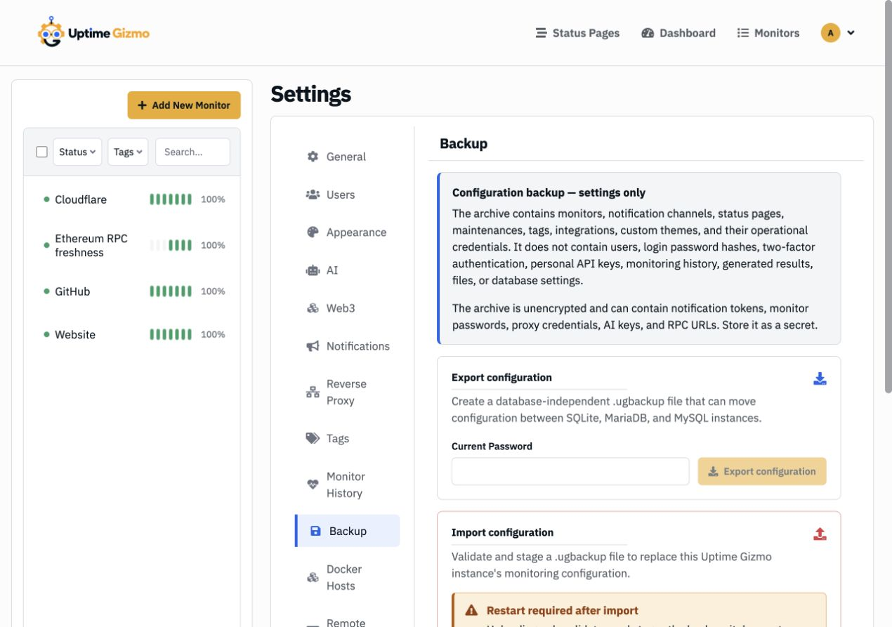
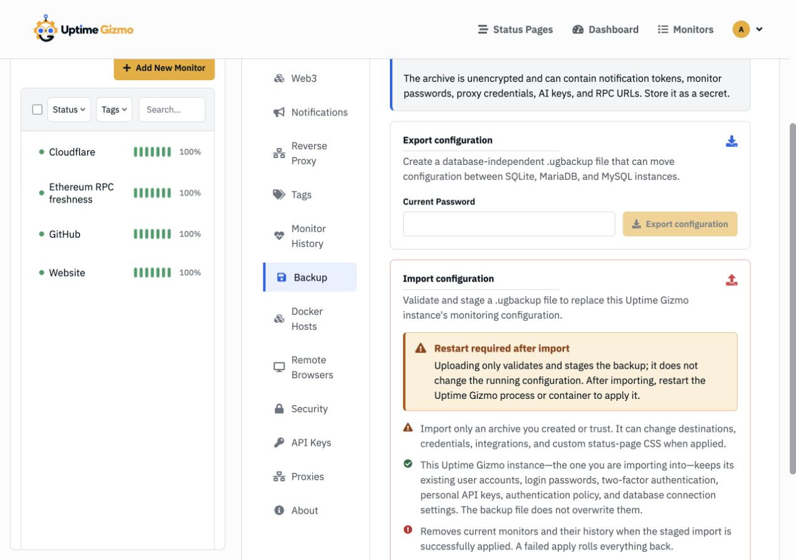

# Move Uptime Gizmo Configuration Without Moving the Database

_Export the monitoring setup you care about, import it into a fresh instance,
and leave accounts and historical measurements behind._

> Configuration Backup is available in Uptime Gizmo 3.0.0-beta.5.

Moving an uptime service used to mean moving its database. That works when the
destination uses the same database engine and schema, but it is awkward when you
want a clean instance, a different database, or a staging copy without years of
heartbeat history.

Uptime Gizmo's Backup page takes a narrower approach: it moves configuration,
not the database.

The page is administrator-only and deliberately unavailable through the REST
API, MCP server, and agent skills. Moving a complete monitoring setup should
remain an explicit human operation.

The `.ugbackup` archive includes monitors, notification channels, status pages,
maintenance windows, tags, integrations, custom themes, and the operational
credentials those settings need. It works across SQLite, MariaDB, and MySQL.

It deliberately leaves out user accounts, login password hashes, two-factor
authentication, personal API keys, authentication policy, database connection
settings, monitor history, aggregates, completed incidents, logs, uploads, and
generated files.

This is a configuration migration tool, not a disaster-recovery backup. Keep
your normal database and volume backups if you need to restore accounts or
historical data.

## Step 1: prepare the instance you are importing into

Install and start the destination instance normally. Choose its database engine,
create its administrator account, configure authentication, and confirm that you
can sign in.

Those destination-side choices stay in place during import. The backup does not
replace them.

For the smoothest move, run the same Uptime Gizmo version on both sides. If the
destination is newer, check its Backup documentation for archive compatibility
first. The importer rejects archive formats it does not support.

## Step 2: export from the source instance

Sign in to the source as an administrator and open **Settings → Backup**.

Under **Export configuration**:

1. Enter your current login password.
2. Select **Export configuration**.
3. Save the downloaded `.ugbackup` file.

The password proves that the signed-in administrator is present; it is not used
to encrypt the archive.

## Step 3: treat the archive as a secret

A `.ugbackup` file is plain, unencrypted JSON. Depending on your setup, it can
contain notification tokens, monitor credentials, proxy passwords, AI provider
keys, Web3 RPC URLs, and custom status-page CSS.

Store it with the same care as an environment file or password-manager export.
Do not attach it to an issue, commit it to Git, or leave it in a public download
folder. Remove temporary copies after you have verified the move.

## Step 4: validate and stage the import

On the destination instance, open **Settings → Backup** and move to **Import
configuration**.

1. Choose the trusted `.ugbackup` file.
2. Enter the current password for the administrator account on this destination
   instance.
3. Select **Import configuration**.
4. Read the replacement summary and confirm.

Import replaces the destination's current monitoring configuration; it does not
merge two setups. Existing destination monitors and their history are removed
when the staged import is successfully applied.

Uploading the file does not immediately change the running configuration. The
server validates a strict allow-list of supported fields, rejects malformed or
oversized input and broken references, and stages a canonical copy for startup.
It does not unpack files or execute SQL from the archive.

Only import an archive you created or trust. Structural validation cannot make
an intentionally harmful configuration safe: an archive can still change alert
destinations, credentials, integrations, and status-page CSS.

## Step 5: restart Uptime Gizmo to apply it

A process or container restart is required after a successful import. Restart
Uptime Gizmo itself—not the database—and use the normal mechanism for your
deployment, such as restarting the Docker Compose service or systemd unit.

The replacement is applied in one database transaction during startup. If any
part fails, the transaction rolls back instead of leaving half of the imported
configuration active. The pre-restart staging step is what makes that boundary
possible; there is no live-apply path in beta.5.

## Step 6: verify the move

Sign in with the destination account and password you created before the import.
Then check:

- Monitors are present and begin producing fresh heartbeats.
- Notification channels point to the intended destinations.
- Status pages, including their groups, links, domains, passwords, incidents,
  and custom CSS, look correct.
- Maintenance windows, tags, Web3 networks, and other integrations are present.
- Credentials that depend on destination networking can still reach their
  targets.

Do not expect old charts or incident history to appear. The first post-import
heartbeat starts the new instance's history.

Also do not expect source accounts or API keys. The destination keeps its own
users, login passwords, two-factor authentication, personal API keys,
authentication policy, and database connection settings. That separation is
intentional: a configuration move should not quietly become an identity or
database takeover.

## Where this workflow fits

Configuration Backup is a good match for moving from SQLite to MariaDB or MySQL,
building a clean replacement instance, cloning production configuration into an
isolated lab, or recovering the monitoring setup without carrying a large history
table with it.

If your goal is a byte-for-byte recovery with accounts and history intact, back
up the data directory or database instead. The two approaches solve different
problems, and many production deployments should use both.

For the complete field scope and operational notes, see the
[Backup wiki](../wiki/backup.md).
