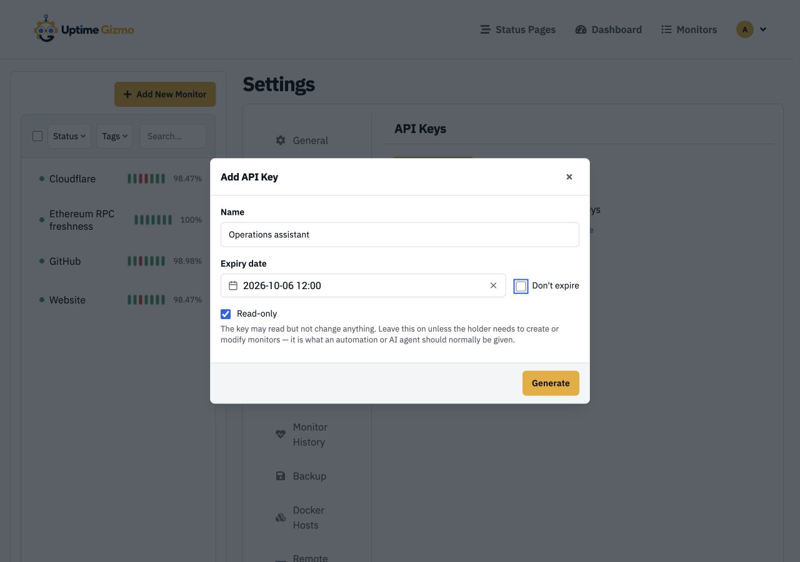
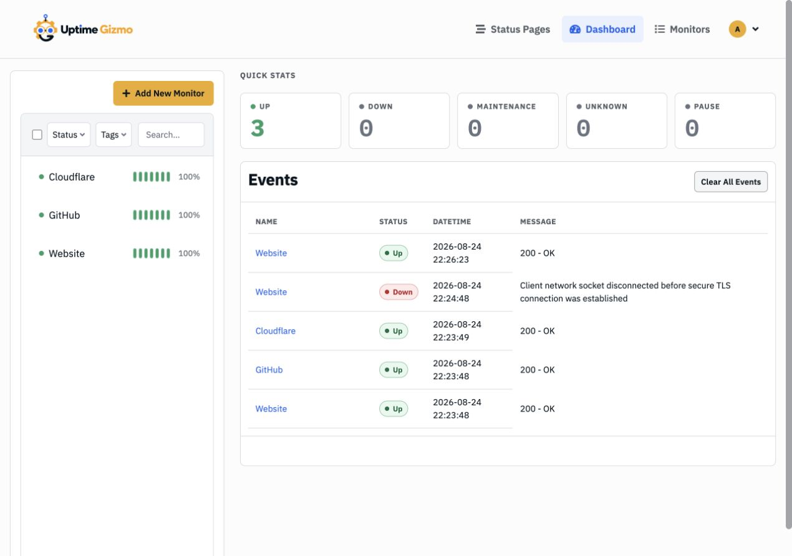
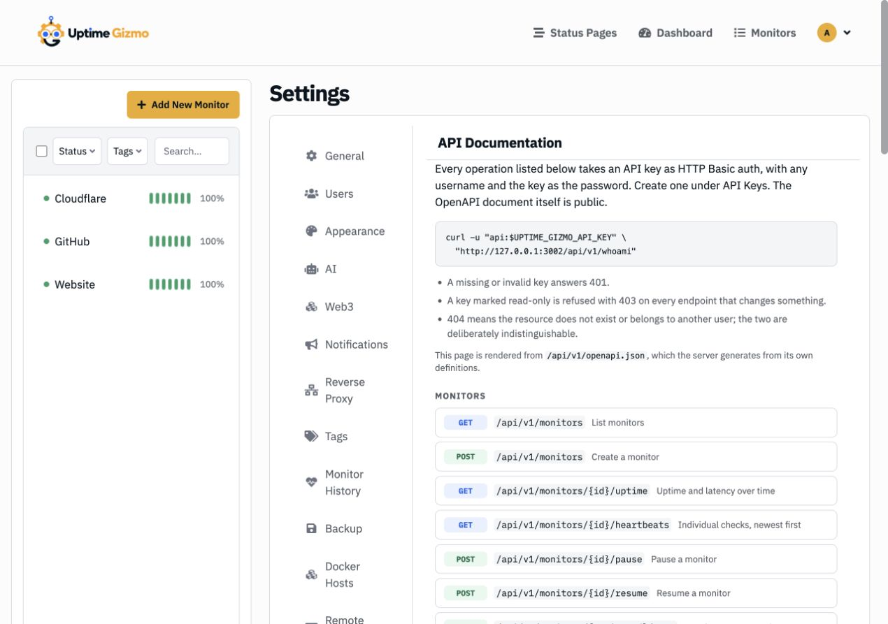

# Give Your AI Agent a Read-Only Window Into Uptime Gizmo

_Use MCP or a focused agent skill to investigate incidents without pasting
dashboard screenshots into a chat._

> This walkthrough uses Uptime Gizmo 3.0.0-beta.5.

An uptime dashboard answers questions well when you are looking at it. The
interesting shift happens when the same data becomes available to the agent
helping you debug: it can check what is down, compare recent state changes, and
pull the right monitor details while you stay in the conversation.

Uptime Gizmo now supports that workflow in two ways:

- A local MCP server exposes purpose-built monitoring tools to an MCP client.
- Two portable agent skills teach a compatible coding agent how to use the REST
  API directly.

Both use a personal API key. Neither gives the model your Uptime Gizmo password,
and a read-only key cannot change your monitoring configuration.

## Before you start

You need a running Uptime Gizmo instance, an account that can create API keys,
and Node.js 20 or newer on the machine that will run the MCP server. The MCP
server is a small, separate process under `mcp-server`; it talks to Uptime Gizmo
over `/api/v1` and does not run inside the monitoring process.

## Step 1: create a key for the agent

Open **Settings → API Keys**, select **Add API Key**, and give the key a name that
says who or what will use it. Set an expiration date that fits the job.

Leave **Read-only** enabled for investigation, status summaries, and incident
triage. It is the safe default and the right choice for most agent connections.



Select **Generate** and copy the key when it appears. Uptime Gizmo only shows the
clear-text value once. Store it in your client's environment or secret manager,
not in a prompt, repository, or skill file.

If you later want an agent to create or update monitors, make a separate key
with **Read-only** disabled. The MCP write tools intentionally stop at create and
update; they do not delete monitors.

## Step 2: install the MCP server

Use the `mcp-server` directory from the same Uptime Gizmo release as your
instance:

```bash
cd /path/to/uptime-gizmo/mcp-server
pnpm install --frozen-lockfile
```

The process has no database access. Its only connection to your instance is the
URL and API key you provide next.

## Step 3: connect your MCP client

Add a server entry to your client's MCP configuration. The surrounding file and
reload behavior vary by client, but the server definition is the same:

```json
{
  "mcpServers": {
    "uptime-gizmo": {
      "command": "node",
      "args": ["/absolute/path/to/uptime-gizmo/mcp-server/index.mjs"],
      "env": {
        "UPTIME_GIZMO_URL": "https://uptime.example.com",
        "UPTIME_GIZMO_API_KEY": "uk1_..."
      }
    }
  }
}
```

Use an absolute path for `index.mjs`. If Uptime Gizmo sits behind a reverse
proxy, `UPTIME_GIZMO_URL` should be the same public root URL you use in a browser,
without `/api/v1` appended.

Restart or reload the MCP client, then ask it to list the tools exposed by
`uptime-gizmo`. A good first request is:

> Check Uptime Gizmo for anything currently down. If everything is healthy,
> summarize the monitor counts and the most recent state changes.

That request usually combines `get_active_incidents`, `get_overview`, and
`get_recent_changes`. The result should agree with the dashboard rather than
inventing a second source of truth.



## Step 4: know what the agent can see

The read tools cover the parts of Uptime Gizmo that are useful during an
investigation: overview, active incidents, recent changes, monitors, tags,
maintenance windows, notification channel summaries, and configured
infrastructure such as proxies, Docker hosts, remote browsers, AI credential
summaries, and Web3 networks.

Credentials stay behind the API boundary. Notification tokens, proxy passwords,
AI keys, Web3 RPC URLs, and other stored secrets are not returned.

The built-in API page is useful when you want to see the exact REST operation
behind a tool. Open **Settings → API Documentation**. It is generated from the
server's OpenAPI definitions, so it tracks the version you are actually running.



## Step 5: add a portable agent skill when it fits better

MCP is convenient when your client already speaks MCP. A skill is lighter when
your coding agent can follow a `SKILL.md` file and call HTTP itself.

Uptime Gizmo ships two skills:

- `uptime-gizmo-status` is read-only and aimed at incident checks and status
  summaries.
- `uptime-gizmo-sync` can create and update monitors, tags, and notification
  channels. It still refuses to delete monitors.

Copy the skill directory into the location your agent uses for project or user
skills, then set `UPTIME_GIZMO_URL` and `UPTIME_GIZMO_API_KEY` in that agent's
environment. Do not edit the key into `SKILL.md`; the file is meant to be safe to
commit and share.

## A practical permission split

Use one short-lived, read-only key for everyday diagnosis. If you want an agent
to maintain configuration, issue a different writable key, scope its use to
that workflow, and disable it when the work is over.

That split keeps the useful part of agent access—fast, contextual investigation—
without turning every troubleshooting session into an unattended change window.

For the complete tool list and client notes, see the
[MCP and Agents wiki](../wiki/mcp-and-agents.md). For raw HTTP examples, see the
[REST API wiki](../wiki/rest-api.md).
