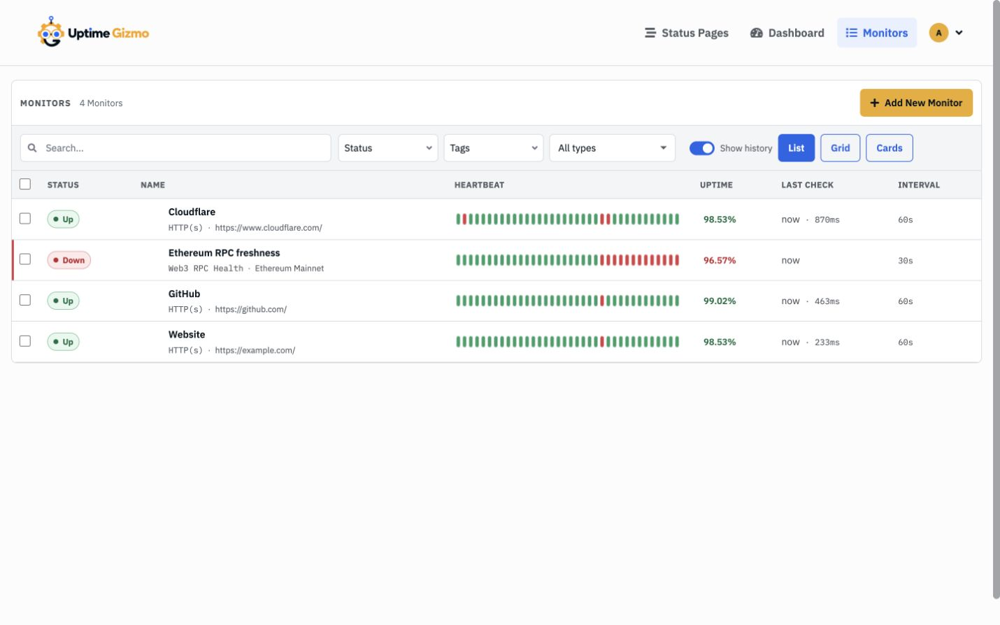
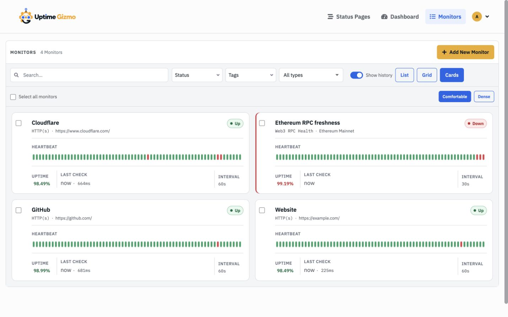
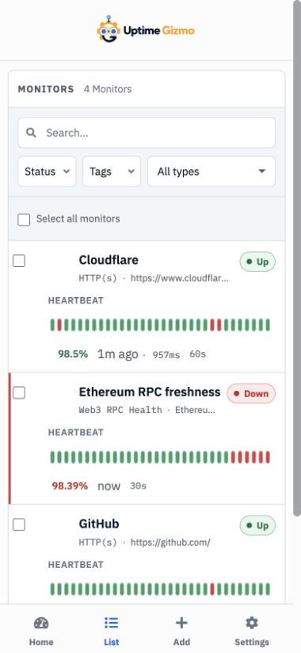

# View All Monitors in One Place

_Use Uptime Gizmo's full-width monitor inventory to scan health, find a target,
and act on a group of monitors without fighting a narrow sidebar._

> The new monitor inventory is available in Uptime Gizmo 3.0.0-beta.5.

The monitor rail on an uptime dashboard is good at one job: moving between a
small set of checks while you investigate. It becomes less comfortable when the
list grows, names start to look alike, and the target behind each monitor
matters as much as its name.

Uptime Gizmo now gives **Monitors** its own full-width page. It keeps the quick
status scan, but adds useful context, real filtering, sortable columns, three
desktop layouts, and a compact mobile view.

If you are coming from Uptime Kuma, the familiar dashboard rail has not
disappeared. The inventory complements it: use the rail while working on one
monitor, and use **Monitors** when you need to understand the complete list.

## Step 1: open the full inventory

Select **Monitors** in the desktop header. On mobile, select **List** in the
bottom navigation.

The default desktop List view puts the operational signals in scan order:

- Current status
- Monitor name, type, and target
- Recent heartbeat history
- 24-hour uptime
- Last check and latency, when the monitor measures it
- Check interval

The target line changes with the monitor type. An HTTP monitor shows its URL, a
TCP check shows `host:port`, an LLM monitor shows the model, a Web3 monitor shows
its network or address, and a group shows its child count. You can tell what a
row is checking without opening its detail page.

Credentials are removed from displayed targets. That includes URL user info,
common secret query parameters, and supported database connection-string
forms. The inventory is still an authenticated operational screen, but it does
not turn a convenient overview into a credential list.

## Step 2: choose the amount of detail you need

Wide screens offer three layouts:

- **List** is the most compact way to compare every signal and sort by column.
- **Grid** favors fast status scanning across a larger number of monitors.
- **Cards** gives each monitor more separation and keeps its heartbeat,
  interval, and metrics together.

Grid and Cards each remember their own **Comfortable** or **Dense** preference,
so changing one does not undo the other.

The **Show history** switch hides or restores heartbeat bars across the current
inventory. Whether history is available at all follows the heartbeat-bar choice
under **Settings → Appearance**.

Your layout and density choices stay in the browser. They do not change how
other users see the same Uptime Gizmo instance.

## Step 3: search by what you actually remember

Search is not limited to the friendly name. It also matches the displayed type
and target, which is useful when you remember a hostname, contract address, or
model but not the label someone gave it.

Use the adjacent controls to narrow the inventory by:

- Current status
- Active or paused state
- Tag
- Monitor type

The type menu includes a count beside every type currently in the inventory.
That makes it useful both as a filter and as a quick summary of what you are
running.

In List view, select a column heading to sort by status, name, uptime, last
check, or interval. Sorting changes the view only; it does not rewrite monitor
weights or the ordering used elsewhere.

## Step 4: keep groups understandable

Groups retain their hierarchy instead of becoming unrelated flat rows. Expand
or collapse a group from any layout, and nested monitors keep their full parent
path.

Filtering also preserves that context. If a child matches, Uptime Gizmo reveals
the matching monitor together with the ancestor path needed to understand where
it belongs.

For routine maintenance, select one or more visible monitors. The bulk action
bar can pause, resume, or delete the selection. Destructive actions keep their
confirmation step, and selecting a row does not unexpectedly open its detail
page.

## Step 5: use the same inventory on a phone

At tablet and phone widths, Uptime Gizmo switches automatically to a compact
stacked list. Layout and density switches disappear because the mobile layout
has already made that choice for the available space.

Search and all three filters remain visible, including a clearly labeled type
filter. Each row still carries its type, target, status, heartbeat history,
uptime, last check, and interval without requiring horizontal scrolling.

Select the monitor name to open its normal detail page. The mobile **List** tab
remains highlighted, so returning to the inventory is one tap away.

## A better division of labor

Dashboard Home remains the place for quick totals and recent events. Monitor
detail remains the place to investigate one check. The new inventory fills the
space between them: a working view for finding, comparing, and maintaining the
checks that make up your monitoring system.

That division is intentionally simple. No new server-side index or duplicate
source of truth is involved—the page uses the same live monitor, heartbeat, and
uptime data already connected to your authenticated session.

For implementation details and the complete behavior reference, see the
[Monitor inventory plan](../plans/monitor-inventory.md).
