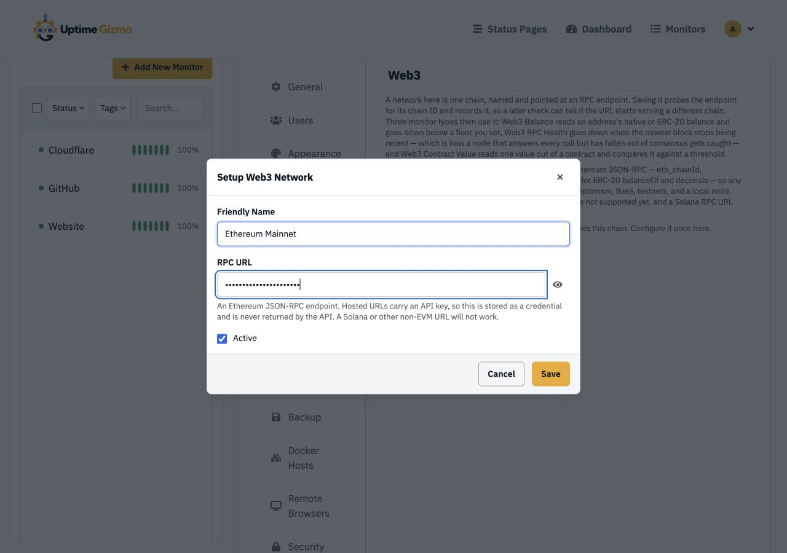
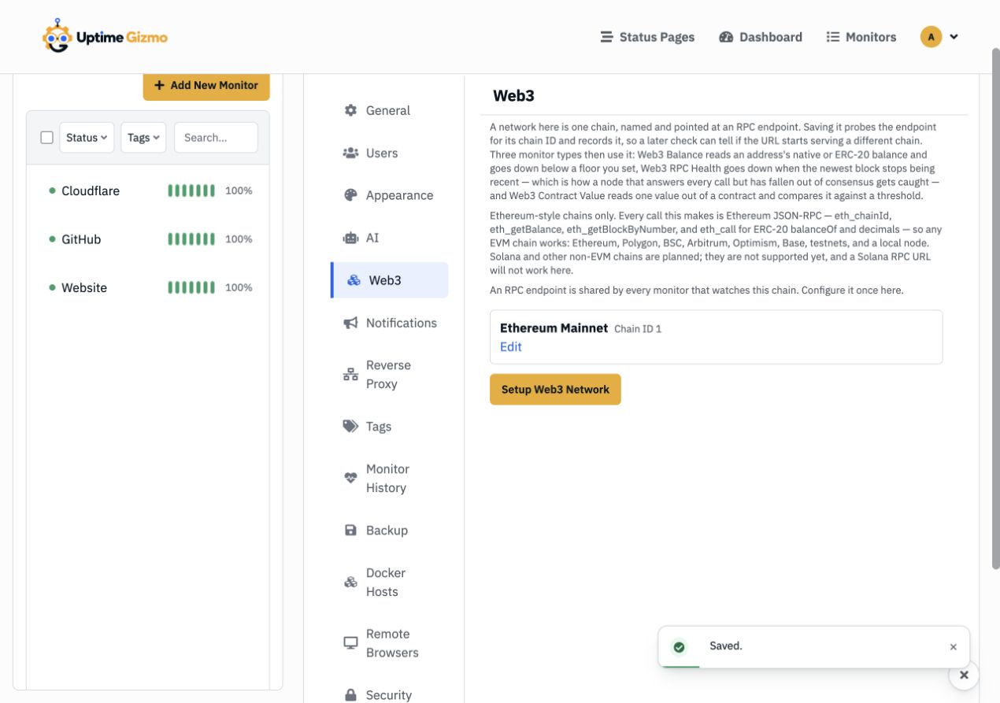
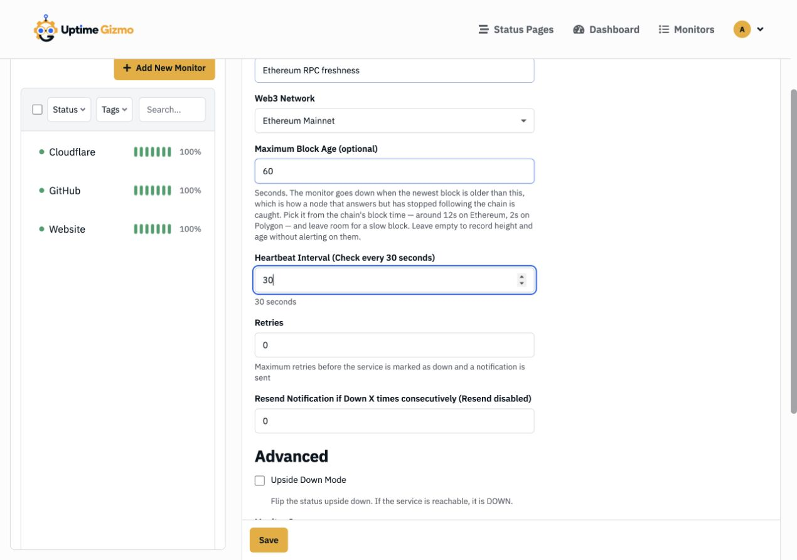
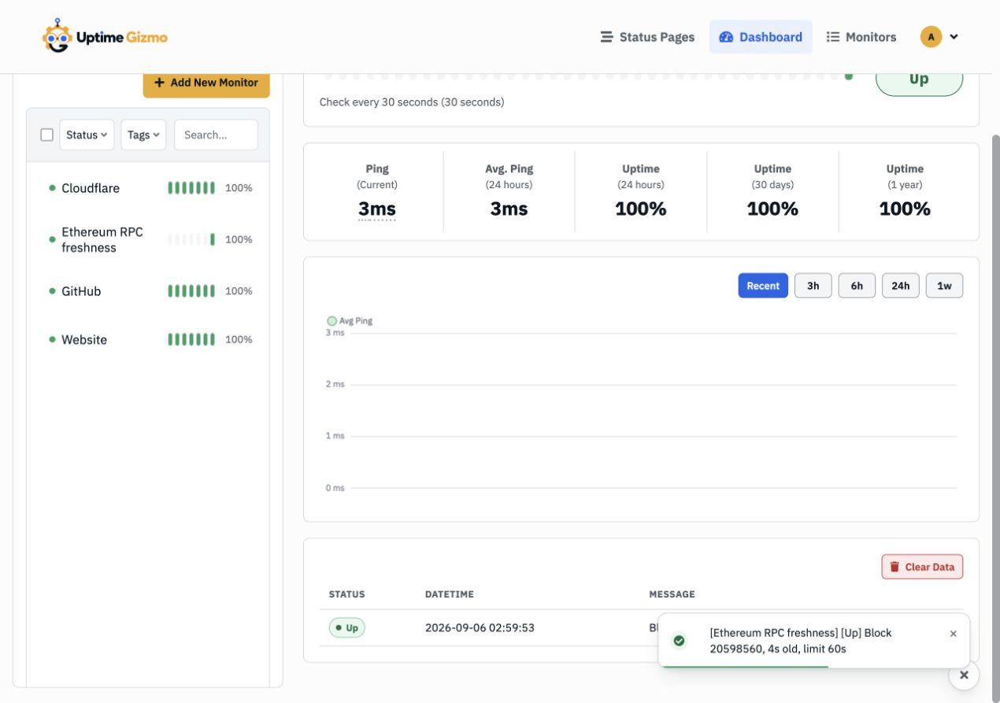
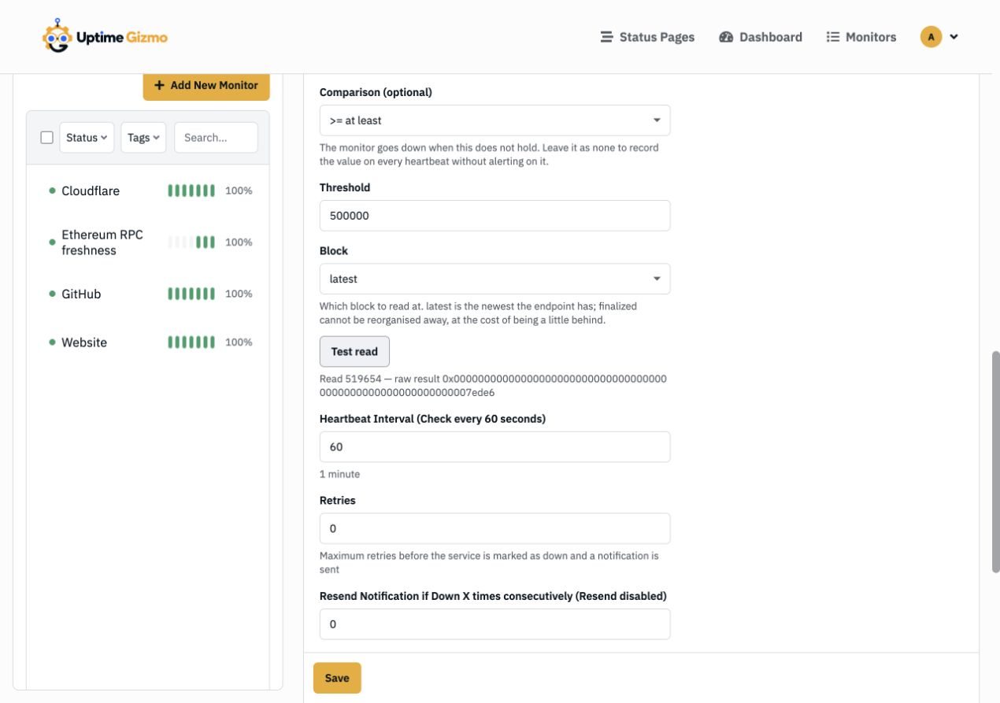

# Monitor EVM Infrastructure Without Giving Up a Private Key

_Track RPC freshness, account balances, and contract state with ordinary uptime
checks—and never put a signing key in the monitor._

> This walkthrough uses Uptime Gizmo 3.0.0-beta.5.

Web3 failures are often quiet. An RPC endpoint can still answer while serving an
old block. A relayer can keep running after its gas balance falls too low to send
the next transaction. A contract can stay reachable while a value that matters
has crossed a dangerous threshold.

Uptime Gizmo adds three EVM monitor types for those cases:

- **Web3 RPC Health** checks the chain ID and age of the latest block.
- **Web3 Balance** reads a native-token or ERC-20 balance and can enforce a
  minimum.
- **Web3 Contract Value** makes a read-only `eth_call`, decodes one result word,
  and can compare it with a threshold.

All three are read-only. Uptime Gizmo does not accept a private key, sign a
message, or send a transaction.

## Step 1: add an EVM network once

Open **Settings → Web3** and select **Setup Web3 Network**. Give the network a
recognizable name and enter an HTTP or HTTPS Ethereum JSON-RPC endpoint.



When you save, Uptime Gizmo calls `eth_chainId` and records the result. Every
monitor using this network checks that identity before reading data, which catches
an endpoint that was quietly repointed at another chain.



The RPC URL is stored as a credential. It is not returned by the REST API or MCP
tools, which matters when the provider URL contains an API token.

Uptime Gizmo currently supports EVM networks: Ethereum, Base, Arbitrum, Optimism,
Polygon, BSC, compatible testnets, and local EVM nodes. Bitcoin, Solana, and
Cosmos-style RPC endpoints are not supported by these monitor types.

## Step 2: catch an RPC node that is answering but stale

Select **Add New Monitor**, then choose **Web3 RPC Health**.

1. Pick the network you just added.
2. Enter a friendly name, such as `Ethereum RPC freshness`.
3. Set **Maximum Block Age** in seconds.
4. Choose a heartbeat interval and save.



Choose the age limit from the chain's expected block time and leave room for an
occasional slow block. For Ethereum, 60 seconds is a reasonable starting point
for a general availability check; a rollup with faster blocks may justify a
tighter limit. Leave the field empty if you only want to record block height and
age without alerting on them.

The heartbeat message includes the block number, its age, and the configured
limit. This is the evidence you want during an RPC incident—not just “HTTP 200.”



## Step 3: watch a relayer or treasury balance

Create another monitor and choose **Web3 Balance**.

- Select the network and enter the account address.
- Leave **Token Contract** empty for the chain's native token.
- For ERC-20, enter the token contract and confirm its decimals.
- Set **Minimum Balance** to the floor below which the monitor should go down.

Amounts are entered as ordinary decimal strings, such as `0.15` or `2500`. They
stay exact all the way through the comparison; Uptime Gizmo does not round large
on-chain integers through JavaScript floating point.

The monitor is also useful without a floor. In that mode it verifies the RPC
read and records the balance in each heartbeat, but it does not alert on the
amount.

## Step 4: turn a contract read into a health check

Choose **Web3 Contract Value** when the health signal lives inside a contract.
You provide the call explicitly:

1. Enter the contract address and ABI-encoded calldata.
2. Choose the returned value type: `uint256`, `int256`, `bool`, `address`, or
   `bytes32`.
3. Set the zero-based word index. A single return value uses `0`.
4. Set decimals for numeric values.
5. Optionally define the comparison that represents a healthy state.
6. Select **Test read** before saving.



The example calls `allPairsLength()` on the Uniswap V2 factory:

```text
Contract:   0x5C69bEe701ef814a2B6a3EDD4B1652CB9cc5aA6f
Calldata:   0x574f2ba3
Type:       uint256
Word index: 0
Decimals:   0
Healthy:    value >= 500000
```

The screenshot uses a deterministic demo endpoint, so treat its displayed count
as an example; the mainnet value changes over time.

The comparison describes health, not the alert. If you want an alert when a
value rises above `1000`, configure the monitor as healthy while the value is
`<= 1000`. It goes down when that statement stops being true.

Calldata is sent exactly as entered. A valid-looking but incorrect selector or
argument can return a perfectly valid value with the wrong meaning, which is why
**Test read** is part of the setup rather than a debugging afterthought.

## Step 5: let an agent handle the fiddly encoding, carefully

The REST API and MCP server can create all three Web3 monitor types. That can be
handy for contract monitors, where an agent can derive calldata from an ABI and
explain which result word it expects.

Network creation stays in the UI. Give the agent the configured `web3NetworkId`,
the contract and function, the healthy condition, and a writable API key only
for the duration of the change. Then open the monitor and run **Test read**
yourself before relying on the alert.

A useful first deployment is one RPC freshness check plus balance floors for the
accounts that must keep submitting transactions. Those two monitors catch a
surprisingly large class of failures with no wallet integration at all.

For field-by-field reference and API examples, see the
[Web3 Monitoring wiki](../wiki/web3-monitoring.md).
