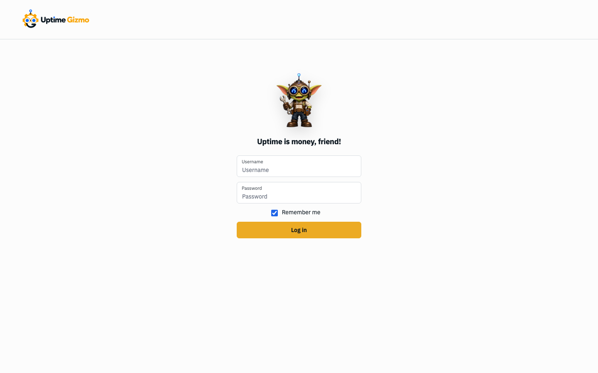
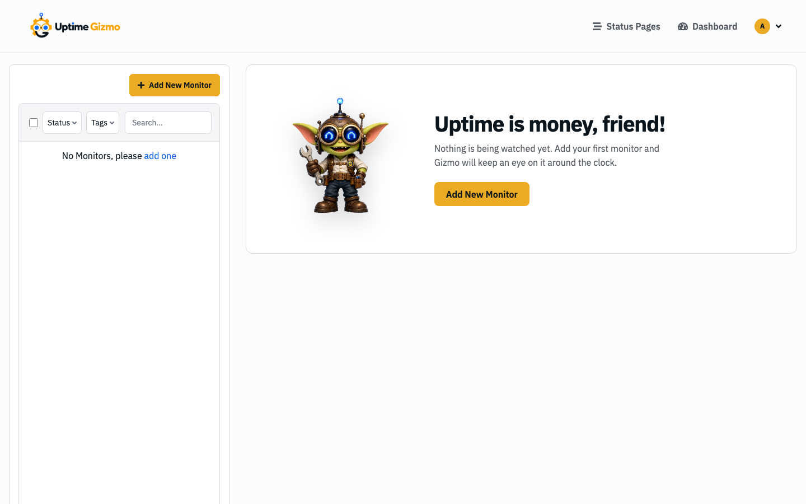
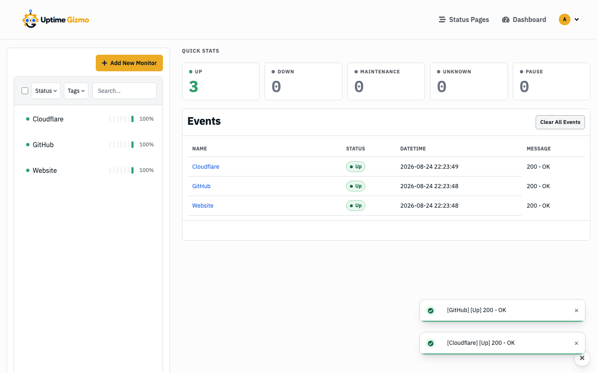
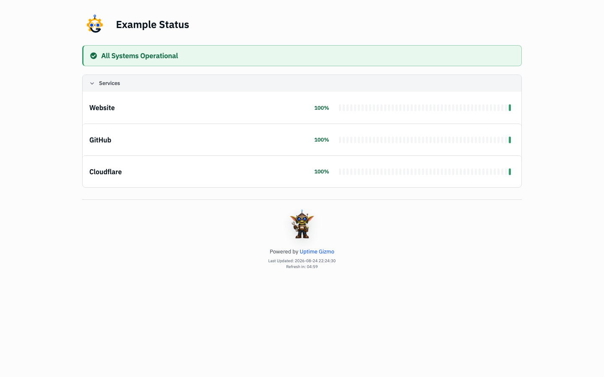
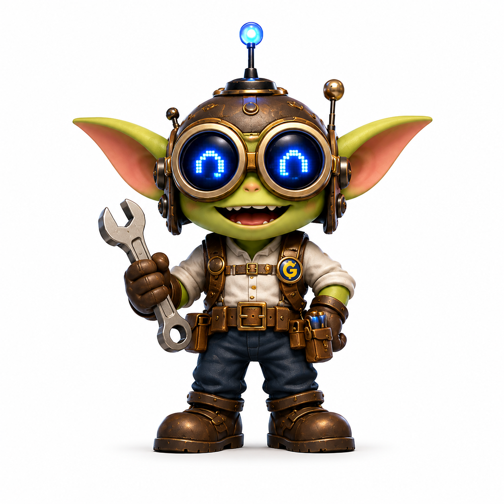
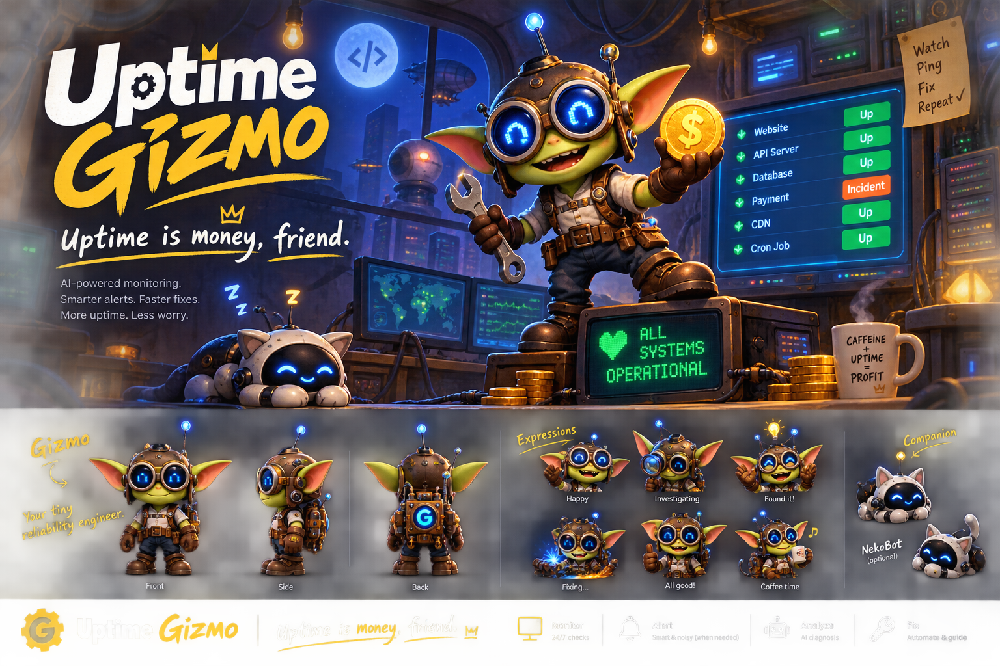

# What Uptime Gizmo adds

  

Uptime Gizmo is a fork of [Uptime Kuma](https://github.com/louislam/uptime-kuma). HTTP checks, notifications, status pages, and the rest of Kuma still work. This wiki covers **what the fork added**, and only what works today.

Planned work is in the [Roadmap](../../ROADMAP.md), not here.

## Look

The interface was rebuilt on a token system (light and dark). These shots are a demo instance with three public HTTP checks.

**Login**

**Empty dashboard**

**Dashboard, light**

**Dashboard, dark**

**Public status page**

More on the public page: [status page](status-page.md).

## Brand

The product logo is a gear, a “G,” and goggles. Gizmo is the engineer mascot — login, empty dashboard, and the public footer. The workshop sheet is campaign art, not used as a UI icon.

  
  &nbsp;&nbsp;&nbsp;
  

  

| Feature | What it is for |
| --- | --- |
| [REST API](rest-api.md) | Read state and history; safely provision monitors, tags, and notification channels over HTTP |
| [MCP and agent skills](mcp-and-agents.md) | An AI client can ask what is down, and optionally create monitors |
| [LLM endpoint monitoring](llm-monitoring.md) | Check that an inference endpoint still returns usable output |
| [Web3 monitoring](web3-monitoring.md) | Watch balances, RPC freshness, and one value from a contract |
| [Themes](themes.md) | Shared palettes, including ones generated from a description |
| [Multiple logins](multiple-logins.md) | Separate passwords for the same instance |
| [Backup](backup.md) | Move monitoring configuration between SQLite, MariaDB, and MySQL instances without moving accounts or history |
| [Public status page](status-page.md) | The public page was rebuilt; overall status leads |

Install and full-backup guidance stay in the [README](../../README.md).
