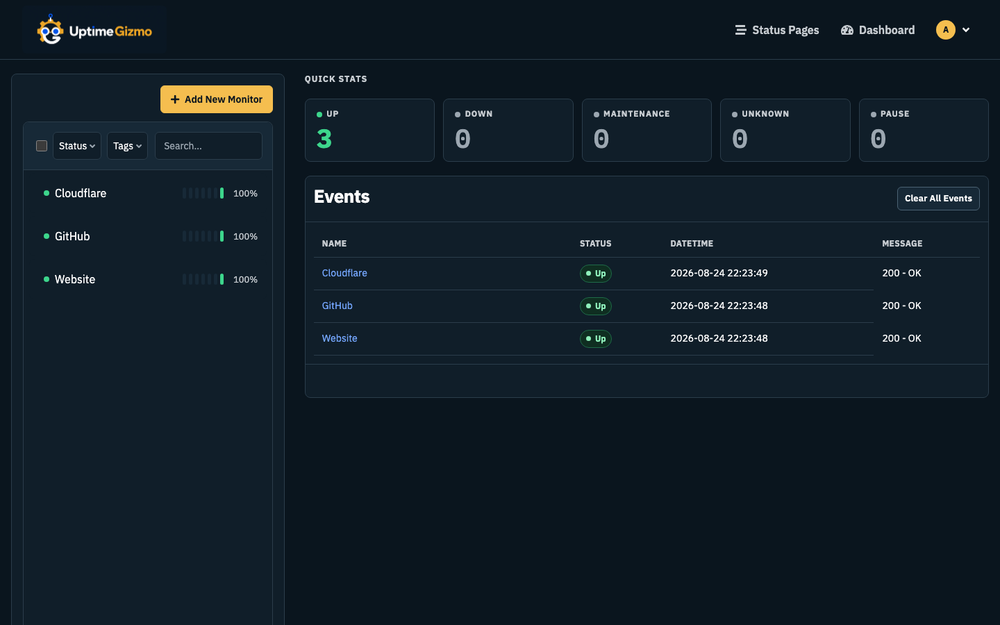

# Themes

Light, dark, and auto still live in this browser (**Settings → Appearance**). **Custom themes live on the instance** and are offered to everyone who signs in.

A custom theme is a palette layered over the built-in light or dark baseline. Which baseline is chosen from the theme’s own background, so a light theme stays light even if you picked Dark above.

## Add a theme

**Settings → Appearance:**

- **Import** JSON from another instance or written by hand.
- **Generate** from a sentence, if an administrator has configured **Settings → AI**.

Generation runs on the server. The LLM API key never reaches the browser. Only an administrator may change the AI credentials — generating a theme sends the key as a Bearer token, so changing the URL a credential points at could send it somewhere else.

**Settings → AI** keeps a list of credentials, each with its own provider, key, and model, and one of them is marked **Use for AI features** — the generate box on the appearance page names that one, so a failure says which credential to go and fix. Alongside the named providers there is a **Custom** one, for any endpoint that speaks the OpenAI chat-completions API — a gateway, a proxy, or a model running on the same machine. The model field suggests models the provider is known for and accepts any other name you type.

A custom credential also has an **API Key Header**. Left empty the key is sent as `Authorization: Bearer`, which is what an OpenAI-compatible endpoint expects; Azure OpenAI wants it in `api-key`, and some gateways in `x-api-key`. Against those, a Bearer header is a 401 whatever the key is. **Test** on the credential sends one short completion and shows what came back, which is where a wrong header, a wrong URL or a wrong key says so.

No credential is required. With none saved, the instance contacts no AI service.

## Contrast gate

Every custom theme is measured against [DESIGN.md](../../DESIGN.md): **4.5:1** for text, **3:1** for indicators and controls. A palette that fails is not stored and not applied. Generation retries up to three times if the model returns something that misses the floor.

## Where it applies

- Workspace: pick the theme in Appearance (this browser).
- Public status pages: each page has its own theme selector, including custom ones. The public page does not follow the dashboard theme.

Hover states, muted fills, and status tints are derived from the sixteen colours the theme supplies. You do not set them by hand.
